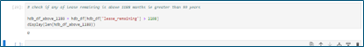
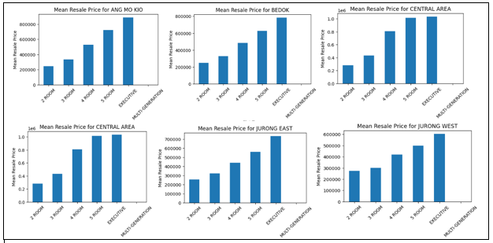
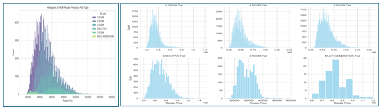
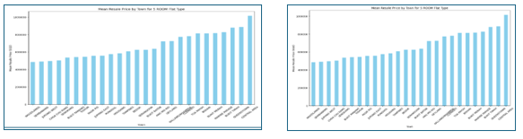
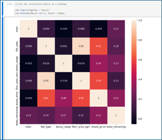
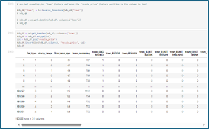

# Predictive Modelling of HDB Resale Prices
# Leveraging Machine Learning for Market Insights and Decision Support

## Overview
This project focuses on the application of machine learning to predict HDB resale prices and providing valuable insights for various stakeholders. It highlights the 
dual goals of developing a predictive model and offering decision support, making it clear and comprehensive.

## Data Source
This dataset includes resale price information for HDB flats in Singapore, covering the period from January 2017 to June 2024. It contains records from reliable sources such as the URA, and other relevant databases. The dataset is comprehensive, showing details such as transaction month, town, flat type, block, street name, storey range, floor area, flat model, lease commencement date, remaining lease, and resale price.

For this project, the dataset is downloaded from Kaggle using Python code, which originally sourced it from data.gov.sg. 

[Dataset](Data/sg-resale-flat-prices-2017-onwards.csv)

The dataset contains 181,262 entries and 11 feature columns. These columns are: 'month', 'town', 'flat_type', 'block', 'street_name', 'storey_range', 'floor_area_sqm', 'flat_model', 'lease_commence_date', 'remaining_lease', and 'resale_price'.

All feature columns, except for three, contains categorical datatypes. The features 'floor_area_sqm' and 'resale_price' are of the float datatype, while the feature 'lease_commence_date' is of the integer data type.

Importantly, the entries to all the features are complete ie there are no null entries or missing values. 

#### Feature Removal
In the initial stages of this data preparation, features deemed inconsequential to the resale price are removed. The selection is based on a judgement call, leveraging my familiarity and understanding of the housing market. Later, a correlation analysis will be conducted to determine which of the remaining features significantly impact the resale price. 

The features removed were ‘street_name’, ‘flat_model’ and ‘block’ (refer to figure below).

#### Determining Outliers
Of the feature columns available, 2 features ie 'floor_area_sqm' and 'resale_price' contained numerical data types and are candidates for outlier analysis.

The boxplot below for ‘floor_area_sqm’ indicates significant outliers, with many entries exceeding 160 square meters and falling below 45 square meters. Upon reviewing the smallest and largest floor areas for HDB flats in Singapore, which range from 45 to 186 square meters, it is reasonable to exclude entries below 45 square meters and above 186 square meters. This adjustment will help ensure the dataset accurately represents typical HDB flat sizes. 

Furthermore, there are only a total 976 out of 181262 entries, strengthening the rationale for their removal.

The boxplot below shows the outlier analysis for ‘resale_price’. The boxplot reveals numerous data points outside the upper bound of Q3 + 1.5 x IQR. Further investigation indicated a total of 3858 entries in this category. A check on the maximum transacted price revealed that the highest transaction is at $1588000, which although seemingly high, accurately reflects the current market trend, particularly on the higher end model. As a result, I have decided to retain all these outliers.

####	Feature Engineering
The dataset contains several categorical features that need to be converted to numerical data types or one-hot encoding. 

For a start, the ‘remaining_lease’ is converted into months to ensure it's suitability for machine learning models. The ‘remaining_lease’ feature is significant as it directly impacts buyer behaviour. Thereafter it will be checked for reasonableness, considering that Singapore’s HDB lease is 99 years or 1188 months.

The figure below shows the conversion of the ‘remaining_lease’ feature from years-and-months format to a months-only format, resulting in a new feature named ‘lease_remaining’, and the removal of ‘remaining_lease’ column. The second figure shows that none of the values in the ‘lease_remaining’ exceeds 1188 months. With the redefinition of ‘remaining_lease’, the features ‘month’ and ‘lease_commence_date’ have become redundant and are removed from the dataset. 

## Exploratory Data Analysis (EDA)

### Descriptive Statistics

#### Key Insights

Floor Area:

The majority of the flats have a floor area between 82 sqm and 112 sqm, with a mean of 97.34 sqm. This suggests that most flats are medium-sized.

Resale Price: 

The resale prices vary significantly, with a mean price of around $498,733.70. The prices are skewed towards higher values, as indicated by the maximum price of $1,588,000.

Lease Remaining: 

The lease remaining for most flats is quite high, with a median of 74.5 years. This indicates that the majority of the flats have a substantial amount of lease remaining, which is a 
positive factor for potential buyers.

### Visualization
Graphical visualizations are powerful tools in data analysis, enabling the identification of trends and patterns that support informed decision-making. In this project, however, the primary purpose of the graphs is to validate the data. For instance, we expect that the price will increase as the floor size increases across all towns, as shown below.

In the next analysis, the histogram (refer to figure below) provides a clear visual representation of the distribution of HDB resale prices across different flat types. 

#### Observations:

Price Distribution
The resale prices for 3 ROOM and 4 ROOM flats are more concentrated in the lower price ranges, while EXECUTIVE and MULTI-GENERATIONAL flats have a wider spread extending into higher price range.

Market Trends
The higher count of 4 ROOM flats in the mid-price range suggests that they are quite popular, possibly to a balance of size and affordability.

Investment Insights
For potential investors or buyers, understanding these distributions can help make informed decisions based on budget and flat type preferences.

Policy Implications
This data could be useful for policymakers to understand housing affordability and demand trends, potentially guiding future housing policies.

From another perspective, when comparing the mean resale prices across various towns by flat types, it becomes evident that certain areas, such as Queenstown, the Central Areas, Bishan, and Ang Mo Kio, consistently have higher prices compared to other towns. This may explain the right-tail distribution of the mean prices across all flat types as shown in the previous graphs. This trend for the mean resale prices across various towns is illustrated in the charts below.

Several factors could contribute to the higher resale prices in towns like Queenstown, the Central Areas, Bishan, and Ang Mo Kio, and within generally accepted expectations.

Location and Accessibility

Proximity to the City Centre: Areas closer to the Central Business District (CBD) and city centre, like Queenstown and the Central Areas, tend to have higher property values due to their prime location.

Transportation Links 

These towns often have excellent public transport links, including MRT stations and bus services, making them highly accessible.

Amenities and Facilities

Educational Institutions: Presence of reputable schools and educational institutions can drive up property prices as families seek to live near good schools.

Healthcare Facilities

Proximity to hospitals and clinics adds to the desirability of these areas.
Shopping and Entertainment: Availability of shopping malls, restaurants, and entertainment options enhances the attractiveness of these towns.

Market Demand

High Demand: These towns may have a higher demand due to their desirable attributes, leading to increased competition and higher prices.

Limited Supply

Limited availability of flats in these prime locations tends to drive prices up.

### Correlation Analysis

To prepare for the correlation analysis, the remaining categorical features (‘town’, ‘flat_type’, and ‘storey_range’) are converted into numerical data types. The ‘town’ feature, which has a larger number of categories, will additionally be one-hot encoded later in preparation for machine learning. 

To identify features that are correlated with the resale price, a heat map is generated. The features ‘flat_type’ and ‘floor_area_sqm’ show strong positive correlations with ‘resale_price’, while ‘lease_remaining’ and ‘storey_range’ exhibit moderate positive correlations. Interestingly, the ‘town’ feature has a weak negative correlation index of –0.045 (refer to heatmap below). 

This is unexpected as the graphs of mean resale prices across towns indicate that some towns command a premium. One possible explanation for this could be outliers or anomalies in the data that affect the correlation coefficient. A few towns with extremely high or low prices might distort the overall correlation. 

Despite it, this feature will be retained for further analysis. I plan to make adjustments at a later stage to improve the low correlation index observed in the data (refer to ‘Model Adjustments’ section).

### One-hot Encoding
The steps below (refer to the figure and code below) demonstrate the one-hot encoding of the ‘town’ feature and the repositioning of the ‘resale_price’ column to the end. The dataset now contains thirty-one columns, incorporating all twenty-six towns. The dataset is now prepared for the machine learning phase.

## Model Development

### Algorigthm Selection
