# Predictive Modelling of HDB Resale Prices
# Leveraging Machine Learning for Market Insights and Decision Support

## Overview
This project focuses on the application of machine learning to predict HDB resale prices and providing valuable insights for various stakeholders. It highlights the 
dual goals of developing a predictive model and offering decision support, making it clear and comprehensive.

## Data Source
This dataset includes resale price information for HDB flats in Singapore, covering the period from January 2017 to June 2024. It contains records from reliable sources such as the URA, and other relevant databases. The dataset is comprehensive, showing details such as transaction month, town, flat type, block, street name, storey range, floor area, flat model, lease commencement date, remaining lease, and resale price.

For this project, the dataset is downloaded from Kaggle using Python code, which originally sourced it from data.gov.sg. 

[Dataset](img/sg-resale-flat-prices-2017-onwards.csv)

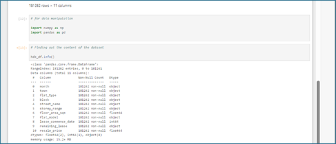

The dataset contains 181,262 entries and 11 feature columns. These columns are: 'month', 'town', 'flat_type', 'block', 'street_name', 'storey_range', 'floor_area_sqm', 'flat_model', 'lease_commence_date', 'remaining_lease', and 'resale_price'.

All feature columns, except for three, contains categorical datatypes. The features 'floor_area_sqm' and 'resale_price' are of the float datatype, while the feature 'lease_commence_date' is of the integer data type.

Importantly, the entries to all the features are complete ie there are no null entries or missing values. 

#### Feature Removal
In the initial stages of this data preparation, features deemed inconsequential to the resale price are removed. The selection is based on a judgement call, leveraging my familiarity and understanding of the housing market. Later, a correlation analysis will be conducted to determine which of the remaining features significantly impact the resale price. 

The features removed were ‘street_name’, ‘flat_model’ and ‘block’ (refer to figure below).

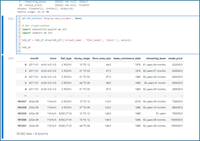

#### Determining Outliers
Of the feature columns available, 2 features ie 'floor_area_sqm' and 'resale_price' contained numerical data types and are candidates for outlier analysis.

The boxplot below for ‘floor_area_sqm’ indicates significant outliers, with many entries exceeding 160 square meters and falling below 45 square meters. Upon reviewing the smallest and largest floor areas for HDB flats in Singapore, which range from 45 to 186 square meters, it is reasonable to exclude entries below 45 square meters and above 186 square meters. This adjustment will help ensure the dataset accurately represents typical HDB flat sizes. 

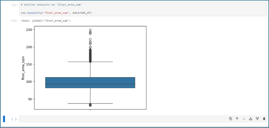

Furthermore, there are only a total 976 out of 181262 entries, strengthening the rationale for their removal.

The boxplot below shows the outlier analysis for ‘resale_price’. The boxplot reveals numerous data points outside the upper bound of Q3 + 1.5 x IQR. Further investigation indicated a total of 3858 entries in this category. A check on the maximum transacted price revealed that the highest transaction is at $1588000, which although seemingly high, accurately reflects the current market trend, particularly on the higher end model. As a result, I have decided to retain all these outliers.

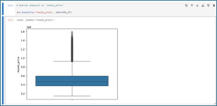

####	Feature Engineering
The dataset contains several categorical features that need to be converted to numerical data types or one-hot encoding. 

For a start, the ‘remaining_lease’ is converted into months to ensure it's suitability for machine learning models. The ‘remaining_lease’ feature is significant as it directly impacts buyer behaviour. Thereafter it will be checked for reasonableness, considering that Singapore’s HDB lease is 99 years or 1188 months.

The figure below shows the conversion of the ‘remaining_lease’ feature from years-and-months format to a months-only format, resulting in a new feature named ‘lease_remaining’, and the removal of ‘remaining_lease’ column. The second figure shows that none of the values in the ‘lease_remaining’ exceeds 1188 months. With the redefinition of ‘remaining_lease’, the features ‘month’ and ‘lease_commence_date’ have become redundant and are removed from the dataset. 

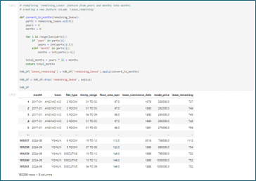

## Exploratory Data Analysis (EDA)

### Descriptive Statistics

#### Key Insights

Floor Area:

The majority of the flats have a floor area between 82 sqm and 112 sqm, with a mean of 97.34 sqm. This suggests that most flats are medium-sized.

Resale Price: 

The resale prices vary significantly, with a mean price of around $498,733.70. The prices are skewed towards higher values, as indicated by the maximum price of $1,588,000.

Lease Remaining: 

The lease remaining for most flats is quite high, with a median of 74.5 years. This indicates that the majority of the flats have a substantial amount of lease remaining, which is a 
positive factor for potential buyers.

### Visualization
Graphical visualizations are powerful tools in data analysis, enabling the identification of trends and patterns that support informed decision-making. In this project, however, the primary purpose of the graphs is to validate the data. For instance, we expect that the price will increase as the floor size increases across all towns, as shown below.

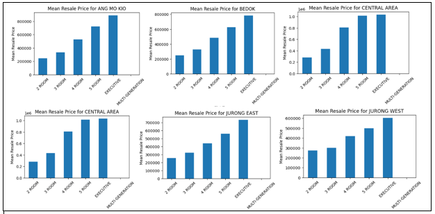

In the next analysis, the histogram (refer to figure below) provides a clear visual representation of the distribution of HDB resale prices across different flat types. 

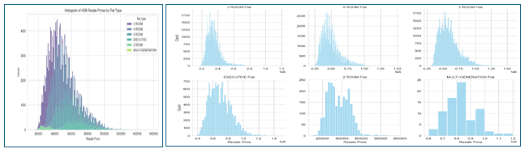

#### Observations:

Price Distribution
The resale prices for 3 ROOM and 4 ROOM flats are more concentrated in the lower price ranges, while EXECUTIVE and MULTI-GENERATIONAL flats have a wider spread extending into higher price range.

Market Trends
The higher count of 4 ROOM flats in the mid-price range suggests that they are quite popular, possibly to a balance of size and affordability.

Investment Insights
For potential investors or buyers, understanding these distributions can help make informed decisions based on budget and flat type preferences.

Policy Implications
This data could be useful for policymakers to understand housing affordability and demand trends, potentially guiding future housing policies.

From another perspective, when comparing the mean resale prices across various towns by flat types, it becomes evident that certain areas, such as Queenstown, the Central Areas, Bishan, and Ang Mo Kio, consistently have higher prices compared to other towns. This may explain the right-tail distribution of the mean prices across all flat types as shown in the previous graphs. This trend for the mean resale prices across various towns is illustrated in the charts below.

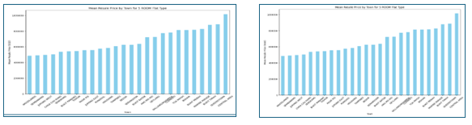

Several factors could contribute to the higher resale prices in towns like Queenstown, the Central Areas, Bishan, and Ang Mo Kio, and within generally accepted expectations.

Location and Accessibility

Proximity to the City Centre: Areas closer to the Central Business District (CBD) and city centre, like Queenstown and the Central Areas, tend to have higher property values due to their prime location.

Transportation Links 

These towns often have excellent public transport links, including MRT stations and bus services, making them highly accessible.

Amenities and Facilities

Educational Institutions: Presence of reputable schools and educational institutions can drive up property prices as families seek to live near good schools.

Healthcare Facilities

Proximity to hospitals and clinics adds to the desirability of these areas.
Shopping and Entertainment: Availability of shopping malls, restaurants, and entertainment options enhances the attractiveness of these towns.

Market Demand

High Demand: These towns may have a higher demand due to their desirable attributes, leading to increased competition and higher prices.

Limited Supply

Limited availability of flats in these prime locations tends to drive prices up.

### Correlation Analysis

To prepare for the correlation analysis, the remaining categorical features (‘town’, ‘flat_type’, and ‘storey_range’) are converted into numerical data types. The ‘town’ feature, which has a larger number of categories, will additionally be one-hot encoded later in preparation for machine learning. 

To identify features that are correlated with the resale price, a heat map is generated. The features ‘flat_type’ and ‘floor_area_sqm’ show strong positive correlations with ‘resale_price’, while ‘lease_remaining’ and ‘storey_range’ exhibit moderate positive correlations. Interestingly, the ‘town’ feature has a weak negative correlation index of –0.045 (refer to heatmap below). 

This is unexpected as the graphs of mean resale prices across towns indicate that some towns command a premium. One possible explanation for this could be outliers or anomalies in the data that affect the correlation coefficient. A few towns with extremely high or low prices might distort the overall correlation. 

Despite it, this feature will be retained for further analysis. I plan to make adjustments at a later stage to improve the low correlation index observed in the data (refer to ‘Model Adjustments’ section).

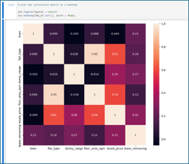

### One-hot Encoding
The steps below (refer to the figure and code below) demonstrate the one-hot encoding of the ‘town’ feature and the repositioning of the ‘resale_price’ column to the end. The dataset now contains thirty-one columns, incorporating all twenty-six towns. The dataset is now prepared for the machine learning phase.

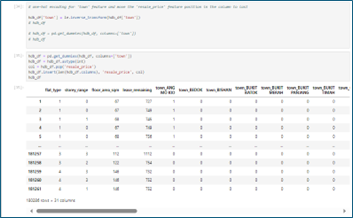

## Model Development

### Algorigthm Selection
In this section, I will explore various machine learning algorithms, in particular the Linear Regression, Decision Trees, and Random Forest, to predict resale prices. 
The reasons for selecting these algorithms are as follows:

Linear Regression

•	Simplicity: It’s a straightforward algorithm that is easy to implement and interpret.

•	Efficiency: Works well with smaller datasets and provides a good baseline for comparison with more complex models.

•	Interpretability: The coefficients can give insights into the relationship between features and the target variable.

Decision Trees

•	Non-linearity: Can capture non-linear relationships between features and the target variable.

•	Interpretability: The tree structure is easy to visualize and understand, making it clear how decisions are made.

•	Feature Importance: Can provide insights into the importance of different features in predicting the target variable.

Random Forest

•	Robustness: Combines multiple decision trees to reduce overfitting and improve generalization.

•	Accuracy: Often provides better predictive performance compared to individual decision trees.

•	Feature Importance: Aggregates feature importance from multiple trees, giving a more reliable measure of feature significance.

These algorithms offer a good mix of simplicity, interpretability, and predictive power, making them suitable for initial exploration and comparison in this machine learning project.

### Preparation for Model Training

In this process of feature selection for multiple linear regression, the target variable `resale_price` is isolated from the dataset to serve as the dependent variable, while all other columns are designated as independent variables for the model. 

The independent variables, which represent various factors influencing resale prices, are stored in a new DataFrame (`x`) by dropping the `resale_price` column. Meanwhile, `resale_price` is set as the output variable (`y`) for the regression analysis. 

This setup allows the model to use the input features to predict resale prices in a housing dataset, facilitating the next steps of splitting the data for training and testing, fitting the model, and making predictions (refer to figure below).

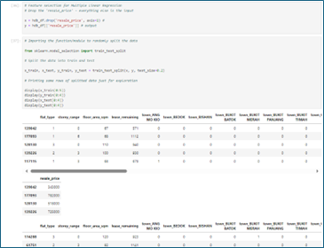

### Model Training

The code below demonstrates the steps involved in training the model. It starts by importing the required libraries and evaluation metrics, then proceeds to instantiate the model using Linear Regression. The model is then fitted to the training data, and finally, the results are generated.

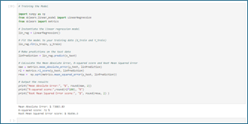

## Model Evaluation

### Performance Metrics

In this section, the performance of this regression model is evaluated to determine its efficacy in predicting the target variable accurately and reliably. To assess the quality of this model, I used three key metrics: R-squared (R²), Mean Absolute Error (MAE), and Root Mean Squared Error (RMSE). By analysing these metrics, we can gauge the accuracy of the predictions, identify potential overfitting, and understand the model's strengths and weaknesses in capturing the underlying data patterns.

Key results

Mean Absolute Error (MAE): $73,883.89

This metric indicates the average magnitude of errors in predictions. In this case, the average difference between the predicted and actual values is around $73,484.42.

R-squared Score (R²): 72%

The R-squared score indicates how well the model captures the variability of the target variable. A score of 72% means that 72% of the total variance in resale price can be explained by the feature variables, suggesting that the model provides a reasonably good fit to the data.

Root Mean Squared Error (RMSE): $91,456.30

RMSE represents the square root of the average of the squared differences between the predicted and actual values. An RMSE of $91,002.31, which is larger than the MAE, indicates that some predictions are significantly farther from the actual values. This suggests that the dataset may have considerable variability, or improvements might be needed, such as exploring different model types to reduce prediction errors.

### Model Comparison

Additionally, the model is trained using Decision Tree Regression and Random Forest algorithms. The goal is to compare and evaluate which model performs best for predicting HDB resale prices.

The models are evaluated using Mean Absolute Error (MAE), R-squared (R²), and Root Mean Squared Error (RMSE) metrics to determine which performs best on the same test set (refer to figures below).

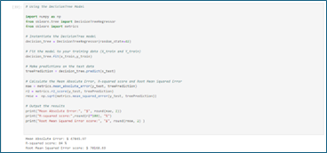

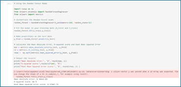

The results from the three iterations show a clear progression in model performance:

Linear Regression Model

The Mean Absolute Error (MAE) is $73,663.38, with an R-squared score of 72% and a Root Mean Squared Error (RMSE) of $91,239.11. This indicates that the model's predictions are relatively far from the actual values, and the R-squared score suggests that about 72% of the variance in the resale prices is explained by the model.

Decision Tree Regressor Model

There's a noticeable improvement, with the MAE decreasing to $47,623.40 and the R-squared score rising to 83%. The RMSE also improves to $69,734.81. This suggests that the model is better at capturing the underlying patterns in the data, resulting in more accurate predictions.

Random Forest Regressor Model

The results continue to improve, with the MAE further reduced to $40,324.28 and the R-squared score increasing to 89%. The RMSE decreases to $57,064.70, indicating that the model has become significantly more accurate and is able to explain a larger portion of the variance in resale prices.

Overall, the consistent decline in MAE and RMSE, along with the increase in R-squared scores, demonstrates effective model enhancement across the tests, suggesting that the techniques or parameters being adjusted are yielding positive results.

### Model Adjustments

Given the unexpectedly low correlation between ‘town’ and ‘resale_price’ shown in the heatmap, which contrasts with findings that towns closer to amenities tend to have higher resale prices, I will now attempt to remove all the outliers that were retained in the earlier analysis.

Analysing Outliers by Flat Types

This analysis aims to identify the onset of outliers within the dataset categorized by ‘flat_type’. Once identified, the records containing these outliers will be removed. This adjustment is intended to evaluate whether the model’s performance can be enhanced by excluding these extreme values.

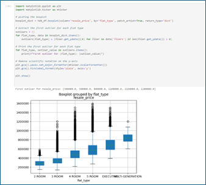

The boxplots above illustrate the outliers for each flat type, marking the initial data points identified for removal. As a result, the dataset now comprises 173,851 rows, down from the original 180,286 rows. The figures below show the boxplot and the reconstructed histogram with the removed outliers.

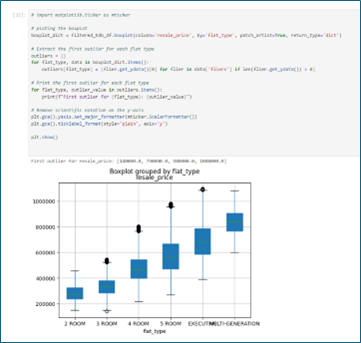

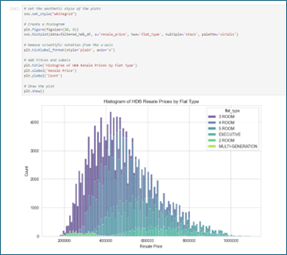

A quick comparison of the filtered versus unfiltered data (see figures below) reveals that a significant amount of information has been removed in the filtered dataset. Notably, floor levels from the 43rd storey onwards are missing. This omission does not accurately represent the real situation.

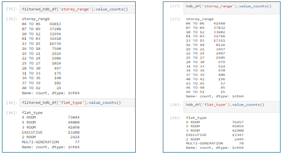

The figure below illustrates the correlation after adjusting for outliers. The correlation indices between flat_type, floor_area_sqm, storey_range, and lease_remaining in relation to resale_price have all increased slightly. However, the correlation between town and resale_price has weakened. While this aligns with expectations, removing the town feature is not realistic, as this feature should impact resale prices.

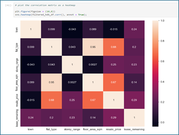

Here are the results (refer to figures below) of the MAE, R², and RMSE scores after iterating with Linear Regression, Decision Tree Regression, and Random Forest models:

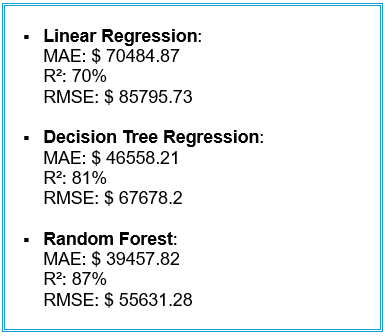

When comparing the results before and after removing outliers (refer to figures below), improvements in the MAE and RMSE scores are evident. However, the R² scores have decreased slightly by 1 to 2%. The decision to retain or remove outliers is debatable, but I recommend keeping the outliers to ensure the results remain realistic and to capture the real situation in the market.

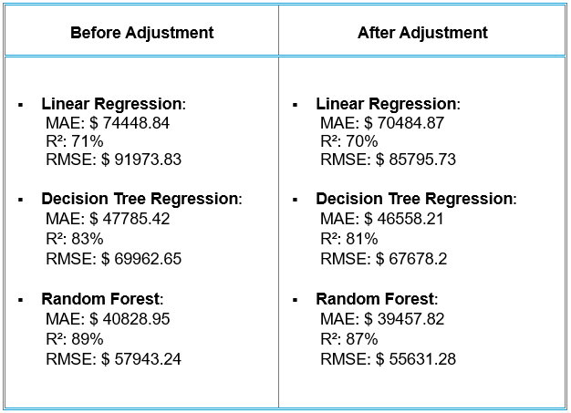

## Conclusion

The HDB Resale Prediction Project has successfully demonstrated the potential of machine learning (ML) and artificial intelligence (AI) in accurately forecasting HDB resale prices. By leveraging a diverse set of features, including location, flat type, floor area, and transaction history, the model achieved a relatively high degree of predictive accuracy.

### Key Findings

•	Predictive Performance and Accuracy

The model’s performance metrics indicate a robust ability to predict resale prices, with a mean absolute error (MAE) of $ 40828.95, R-squared (R²) of 89% and a root mean square error (RMSE) of $ 57943.24.

•	Feature Importance

Flat type and floor area emerged as the most significant predictors, highlighting the importance of flat type and size in determining resale values.

•	Biases 

Although not examined in this project, the dataset may contain historical biases, such as location preferences or economic conditions that have evolved over time.

Also, some machine learning algorithms might inherently favour certain features over others, leading to biased predictions. This is shown in the model iteration exercise earlier.
