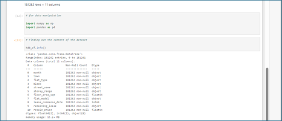
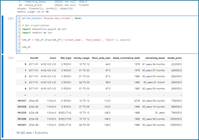
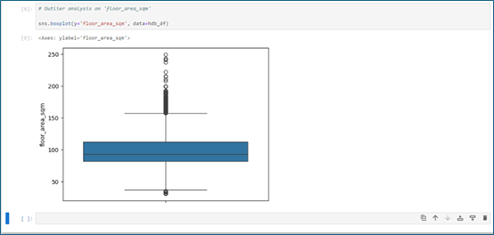
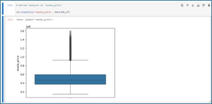

# Predictive Modelling of HDB Resale Prices
# Leveraging Machine Learning for Market Insights and Decision Support

## Overview
This project focuses on the application of machine learning to predict HDB resale prices and providing valuable insights for various stakeholders. It highlights the 
dual goals of developing a predictive model and offering decision support, making it clear and comprehensive.

## Data Source
This dataset includes resale price information for HDB flats in Singapore, covering the period from January 2017 to June 2024. It contains records from reliable sources such as the URA, and other relevant databases. The dataset is comprehensive, showing details such as transaction month, town, flat type, block, street name, storey range, floor area, flat model, lease commencement date, remaining lease, and resale price.

For this project, the dataset was downloaded from Kaggle using Python code, which originally sourced it from data.gov.sg. 

[Dataset](Data/sg-resale-flat-prices-2017-onwards.csv)

The dataset contains 181,262 entries and 11 feature columns. These columns are: 'month', 'town', 'flat_type', 'block', 'street_name', 'storey_range', 'floor_area_sqm', 'flat_model', 'lease_commence_date', 'remaining_lease', and 'resale_price'.

All feature columns, except for three, contains categorical datatypes. The features 'floor_area_sqm' and 'resale_price' are of the float datatype, while the feature 'lease_commence_date' is of the integer data type.

Importantly, the entries to all the features are complete ie there are no null entries or missing values. 

#### Feature Removal
In the initial stages of this data preparation, features deemed inconsequential to the resale price were removed. The selection was based on a judgement call, leveraging my familiarity and understanding of the housing market. Later, a correlation analysis will be conducted to determine which of the remaining features significantly impact the resale price. 

The features removed were ‘street_name’, ‘flat_model’ and ‘block’ (refer to figure below).

#### Determining Outliers
Of the feature columns available, 2 features ie 'floor_area_sqm' and 'resale_price' contained numerical data types and are candidates for outlier analysis.

The boxplot below for ‘floor_area_sqm’ indicates significant outliers, with many entries exceeding 160 square meters and falling below 45 square meters. Upon reviewing the smallest and largest floor areas for HDB flats in Singapore, which range from 45 to 186 square meters, it is reasonable to exclude entries below 45 square meters and above 186 square meters. This adjustment will help ensure the dataset accurately represents typical HDB flat sizes. 

Furthermore, there are only a total 976 out of 181262 entries, strengthening the rationale for their removal.

The boxplot below shows the outlier analysis for ‘resale_price’. The boxplot reveals numerous data points outside the upper bound of Q3 + 1.5 x IQR. Further investigation indicated a total of 3858 entries in this category. A check on the maximum transacted price revealed that the highest transaction is at $1588000, which although seemingly high, accurately reflects the current market trend, particularly on the higher end model. As a result, I have decided to retain all these outliers.

####	Feature Engineering
The dataset contains several categorical features that need to be converted to numerical data types or one-hot encoding. 

For a start, the ‘remaining_lease’ was converted into months to ensure it's suitability for machine learning models. The ‘remaining_lease’ feature is significant as it directly impacts buyer behaviour. Thereafter it will be checked for reasonableness, considering that Singapore’s HDB lease is 99 years or 1188 months.

The figure below shows the conversion of the ‘remaining_lease’ feature from years-and-months format to a months-only format, resulting in a new feature named ‘lease_remaining’, and the removal of ‘remaining_lease’ column. The second figure shows that none of the values in the ‘lease_remaining’ exceeds 1188 months.

